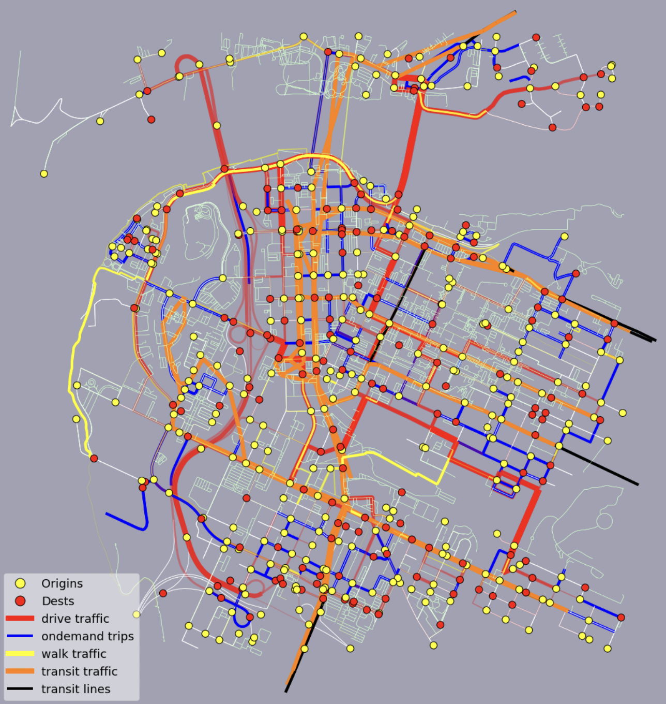
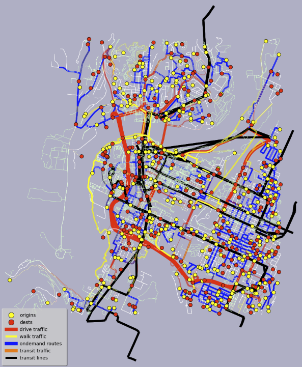

# DOCUMENTATION - Multi-Modal Transit Simulation for CARTA






# FILES
### multimodal_simulation.ipynb 
python notebook that runs the simulation engine
### multimodal_functions.py
support functions for simulation


# OBJECTS

```
GRAPHS = {'drive': GRAPH, 'walk': GRAPH,'transit': GRAPH or FEED,'ondemand': GRAPH}
WORLD = {'drive': NETWORK, 'walk': NETWORK, 'transit': NETWORK,' ondemand': NETWORK}
```

```
NETWORK = {'graph': GRAPH,
           'trips': { (from_node1,to_node1):TRIP_DETAILS,
                      (from_node2,to_node2):TRIP_DETAILS,
                      ...
                    },
            'active_trips': [(from_node1,to_node1),
                             (from_node2,to_node2),
                              ....],
            'edge_masses',
            'edge_costs',
            'current_edge_mass': dict of current masses on each edge in graph,
            'current_edge_costs': dict of masses on each edge in graph,
          }
```
```
TRIP_DETAILS = {
           'active': True or False (indicates whether or not the trip is active. 
           'costs': PREFS,
           'path': [path at iter 1, path at iter 2, etc....],
           'current_path': current shortest path - list of nodes,
           }
```

```
PREFS = {
           'current_time': value of current time cost,
           'current_money': value of current money cost,
           'current_conven': value of current conven cost,
           'current_switches': value of current switching cost,
           'time': list of time costs over iterations,
           'money': list of money costs over iterations,
           'conven': list of conven costs over iterations,
           'switches': list of switching costs over iterations,
           }
```


# FUNCTIONS

### STATE OF OVERALL NETWORK
```
def world_of_drive(WORLD,PEOPLE,GRAPHS,verbose=False): #graph,costs,sources, targets):
    TO BE DOCUMENTED                         
def world_of_walk(WORLD,PEOPLE,GRAPHS,verbose=False): #graph,costs,sources, targets):
    TO BE DOCUMENTED 
def world_of_ondemand2(WORLD,PEOPLE,DELIVERY,GRAPHS,verbose=False):
    TO BE DOCUMENTED 
def world_of_transit_graph(WORLD,PEOPLE,GRAPHS,verbose=False):
    TO BE DOCUMENTED 
```

### TRIP COMPUTATION & CALCULATION
```
def makeTrip2(modes,nodes,NODES,deliveries=[]): #,node_types,NODES,deliveries = []):
    description -- construct a TRIP object consisting of a sequence of modes.
    inputs --
           modes: sequence of travel modes to use (length = n)
           nodes: sequence of nodes for each segment
           NODES: node conversion dictionary
           deliveries: list of ondemand vehicles to use
     return
           trip

def querySeg(start,end,mode,PERSON,NODES,GRAPHS,WORLD):
    description -- queries the cost of travel (for a person) along a particular segment in a given mode
    inputs -- 
           start: start node
           end: end node
           mode: mode of travel
           PERSON: person object
           NODES: node conversion dict
           GRAPHS: graphs object
           WORLD: network information
    returns --
           cost: subjective cost of the trip
           path: optimal path (list of nodes)

def planSeg(source,target,mode,GRAPHS,WORLD,mass=1,track=False):
    description -- computes the optimal path for a particular segment
    inputs -- 
           source: source node
           target: target node
           mode: mode of travel
           GRAPHS: graphs object
           WORLD: network information
           mass: mass to add to edges along the optimal path
           track: (True or False) add data to iteration tracking record.
    returns --

def queryTrip(TRIP,PERSON,NODES,GRAPHS,WORLD):
    TO BE DOCUMENTED

def removeMassFromEdges(mode,WORLD,GRAPHS):
    TO BE DOCUMENTED 
def addTripMassToEdges(trip,NETWORK):
    TO BE DOCUMENTED 

```

### BUS TRANSIT SPECIFIC 
```
def bus_stop_nodes(feed, graph):
    TO BE DOCUMENTED 
def bus_stop_nodes_wgraph(bus_graph, graph):
    TO BE DOCUMENTED 
def bus_connection_nodes(graph,node,bus_stop_nodes,eps=10):
    TO BE DOCUMENTED 
def update_choices2(PEOPLE, DELIVERY, NODES, GRAPHS, WORLD, version=1,verbose=False,takeall=False):
    TO BE DOCUMENTED
```


### ONDEMAND SPECIFIC
```
def divideDelivSegs(trips,DELIVERY,GRAPHS,WORLD,maxTrips = 1000):
    TO BE DOCUMENTED 
def planDelivSegs(sources,targets,start,DELIV,GRAPHS,WORLD,maxSegs=100,track=False):
    TO BE DOCUMENTED 
def next_node2(graph,nodes,current,typ = 'straight'):
    TO BE DOCUMENTED 
def order_pickups2(graph,sources,targets,start,typ='straight'):
    TO BE DOCUMENTED 
def traveling_salesman(graph,pickups,sink):
    TO BE DOCUMENTED 
```
### NODE CONVERSION
```
convertNode(node,from_type,to_type,NODES):
    """
    description -- converts nodes (at approx the same location) between two different graph types 
    inputs --
           node: node to convert
           from_type: initial mode node is given in
           to_type: desired node type
           NODES: node conversion dict - contains dataframes with conversion information
    returns --
           node in desired mode
    """
def find_close_node(node,graph,find_in_graph):
    description -- takes node in one graph and finds the closest node in another graph
    inputs --
          node: node to find
          graph: initial graph node is given in
          find_in_graph: graph to find the closest node in
    returns --
          closest node in the find_in_graph
def addNodeToDF(node,mode,GRAPHS,NODES):
    """
    description -- adds a new node to the NODES conversion dataframe
    inputs --
          node: node to add
          mode: original graph type
          GRAPHS: graphs object containing all graph types
          NODES: node conversion dict - contains dataframes with conversion information
    returns --
    """
def updateNodesDF(NODES):
    """
    description -- updates NODES so each dataframe contains all nodes
    """ 
```

<!---
Inline `code`

Indented code

    // GRAPH = {
    'drive': blah,
    'drive': blah,
    'drive': blah,
    'drive': blah,

Block code "fences"

```
Sample text here...
```

Syntax highlighting

``` js
var foo = function (bar) {
  return bar++;
};

console.log(foo(5));
```


  

---
__Advertisement :)__

- __[pica](https://nodeca.github.io/pica/demo/)__ - high quality and fast image
  resize in browser.
- __[babelfish](https://github.com/nodeca/babelfish/)__ - developer friendly
  i18n with plurals support and easy syntax.

You will like those projects!

---

# h1 Heading 8-)
## h2 Heading
### h3 Heading
#### h4 Heading
##### h5 Heading
###### h6 Heading


## Horizontal Rules

___

---

***


## Typographic replacements

Enable typographer option to see result.

(c) (C) (r) (R) (tm) (TM) (p) (P) +-

test.. test... test..... test?..... test!....

!!!!!! ???? ,,  -- ---

"Smartypants, double quotes" and 'single quotes'


## Emphasis

**This is bold text**

__This is bold text__

*This is italic text*

_This is italic text_

~~Strikethrough~~


## Blockquotes


> Blockquotes can also be nested...
>> ...by using additional greater-than signs right next to each other...
> > > ...or with spaces between arrows.


## Lists

Unordered

+ Create a list by starting a line with `+`, `-`, or `*`
+ Sub-lists are made by indenting 2 spaces:
  - Marker character change forces new list start:
    * Ac tristique libero volutpat at
    + Facilisis in pretium nisl aliquet
    - Nulla volutpat aliquam velit
+ Very easy!

Ordered

1. Lorem ipsum dolor sit amet
2. Consectetur adipiscing elit
3. Integer molestie lorem at massa


1. You can use sequential numbers...
1. ...or keep all the numbers as `1.`

Start numbering with offset:

57. foo
1. bar


## Code

Inline `code`

Indented code

    // GRAPH = {
    'drive': blah,
    'drive': blah,
    'drive': blah,
    'drive': blah,

Block code "fences"

```
Sample text here...
```

Syntax highlighting

``` js
var foo = function (bar) {
  return bar++;
};

console.log(foo(5));
```

## Tables

| Option | Description |
| ------ | ----------- |
| data   | path to data files to supply the data that will be passed into templates. |
| engine | engine to be used for processing templates. Handlebars is the default. |
| ext    | extension to be used for dest files. |

Right aligned columns

| Option | Description |
| ------:| -----------:|
| data   | path to data files to supply the data that will be passed into templates. |
| engine | engine to be used for processing templates. Handlebars is the default. |
| ext    | extension to be used for dest files. |


## Links

[link text](http://dev.nodeca.com)

[link with title](http://nodeca.github.io/pica/demo/ "title text!")

Autoconverted link https://github.com/nodeca/pica (enable linkify to see)


## Images


Like links, Images also have a footnote style syntax

![Alt text][id]

With a reference later in the document defining the URL location:

[id]: https://octodex.github.com/images/dojocat.jpg  "The Dojocat"


## Plugins

The killer feature of `markdown-it` is very effective support of
[syntax plugins](https://www.npmjs.org/browse/keyword/markdown-it-plugin).


### [Emojies](https://github.com/markdown-it/markdown-it-emoji)

> Classic markup: :wink: :crush: :cry: :tear: :laughing: :yum:
>
> Shortcuts (emoticons): :-) :-( 8-) ;)

see [how to change output](https://github.com/markdown-it/markdown-it-emoji#change-output) with twemoji.


### [Subscript](https://github.com/markdown-it/markdown-it-sub) / [Superscript](https://github.com/markdown-it/markdown-it-sup)

- 19^th^
- H~2~O


### [\<ins>](https://github.com/markdown-it/markdown-it-ins)

++Inserted text++


### [\<mark>](https://github.com/markdown-it/markdown-it-mark)

==Marked text==


### [Footnotes](https://github.com/markdown-it/markdown-it-footnote)

Footnote 1 link[^first].

Footnote 2 link[^second].

Inline footnote^[Text of inline footnote] definition.

Duplicated footnote reference[^second].

[^first]: Footnote **can have markup**

    and multiple paragraphs.

[^second]: Footnote text.


### [Definition lists](https://github.com/markdown-it/markdown-it-deflist)

Term 1

:   Definition 1
with lazy continuation.

Term 2 with *inline markup*

:   Definition 2

        { some code, part of Definition 2 }

    Third paragraph of definition 2.

_Compact style:_

Term 1
  ~ Definition 1

Term 2
  ~ Definition 2a
  ~ Definition 2b


### [Abbreviations](https://github.com/markdown-it/markdown-it-abbr)

This is HTML abbreviation example.

It converts "HTML", but keep intact partial entries like "xxxHTMLyyy" and so on.

*[HTML]: Hyper Text Markup Language

### [Custom containers](https://github.com/markdown-it/markdown-it-container)

::: warning
*here be dragons*
:::
--->

